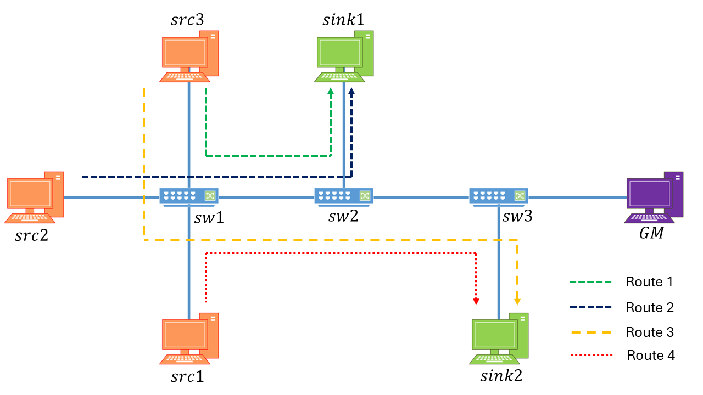

# Introduction
This repository provides a framework for automatically generating Time-Aware Shaper (TAS) schedules (IEEE 802.1Qbv) for Time-Sensitive Networks (TSN), with built-in support for time synchronization based on IEEE 802.1AS. The tool ensures that generated Gate Control Lists (GCLs) align with both traffic requirements and network-wide time synchronization considerations.

# Motivation and Overview
Creating TAS schedules using linear programming methods can be highly complex, especially when working with networks that have multiple time sensitive streams. Manually defining the scheduling constraints is not only time-consuming but also difficult to scale and prone to human errors. Even small incremental changes to the network, like adding a new stream or switch, can significantly increase the number of constrains, making the process harder to manage. Moreover, TAS schedules are tightly linked to network time synchronization. Since time sensitive streams require strict determinism, GCL development requires factoring synchronization considerations while generating valid schedules adds another layer of complexity.  

TAS-Forge provides an automated framework that simplifies the design and validation of TAS schedules for TSN environments with time synchronization considerations. The tool combines MATLAB, CPLEX and OMNeT++ to generate, simulate, and analyze time sensitive traffic flows. 

# Key Features
Key features of TAS-Forge have been described below. 

## 🖼️ Example: Multi-Stream Scheduling

Below is a visual example of a network scenario handled by TAS-Forge. It illustrates how multiple streams can be scheduled across a linear topology using TAS scheduling strategies.

## User-Defined Input:
-	Easily easy specification of the number of switches, sources and sinks to define the structure of the network.
-	Inputs are provided via a simple dialog box, for quick and easy setup process. 

## Automatic Topology & Stream Generation: 
-	Based on user specification, the tool generates a linear network topology. 
-	Routes are automatically created to connect each source to a corresponding sink. 
-	A single source can transmit to multiple sinks, and/or a single sink can receive traffic from multiple sources, allowing for flexible and realistic traffic scenarios.
-	Each route is associated with a stream, and each stream is automatically assigned:
    -	Payload size of frames. 
    -	Transmission periodicity. 
    -	Deadline of stream. 

## IEEE 802.1AS Time Synchronization Modeling: 
-	The framework models clock drift for each device in the network by assigning them random drift values. 
-	Devices synchronize using a defined synchronization periodicity, simulating realistic timing behavior.
-	This enables analyzing the impact of synchronization on TAS scheduling — a feature often overlooked in other TAS scheduling frameworks. 

## TAS Scheduling Frameworks:
-	Users can choose from a suite of TAS scheduling frameworks to apply to schedule generation. 
-	This makes it easy to test and compare different scheduling frameworks under identical network conditions. 

## OMNeT++ File Generation:
-	The tool also automatically generates the required the .ned and .ini files based on:
    -	The generated topology
    -	The scheduling decisions 
    -	Time synchronization parameters
-	These filed can be directed used for simulation in the network simulator tool OMNeT++. 

## Simulation Output & Analysis:
-	After executing the files in OMNeT++, the results can be:
    -	Parsed and analyzed in MATLAB. 
    -	Exported in .csv structure for further inspection and analysis. 
-	The simulator also provides insights into network performance, latency and schedule effectiveness. 

# Dependencies
This version requires the following:

- MATLAB (version 2021b)
- CPLEX (version 22.1.1)
- OMNeT++ (version 6.0.3)
- INET (version 4.4)

