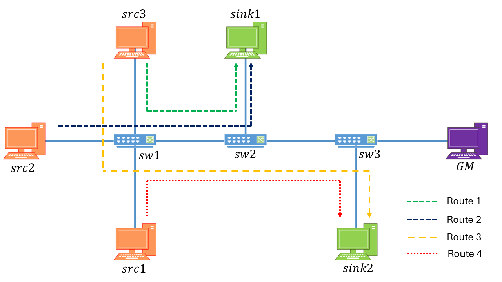

# 🚀 Introduction
This repository provides a framework for automatically generating Time-Aware Shaper (TAS) schedules (IEEE 802.1Qbv) for Time-Sensitive Networks (TSN), with built-in support for time synchronization based on IEEE 802.1AS. The tool ensures that generated Gate Control Lists (GCLs) align with both traffic requirements and network-wide time synchronization considerations.

# 🎯 Motivation and Overview
Creating TAS schedules using linear programming methods can be highly complex, especially when working with networks that have multiple time sensitive streams. 

Manually defining the scheduling constraints is not only time-consuming but also difficult to scale and prone to human errors. Even small incremental changes to the network, like adding a new stream or switch, can significantly increase the number of constraints, making the process harder to manage. 

Moreover, TAS schedules are tightly linked to network time synchronization. Since time sensitive streams require strict determinism, GCL development requires factoring synchronization considerations while generating valid schedules adds another layer of complexity.  

TAS-Forge provides an automated framework that:
- Simplifies the design and validation of TAS schedules.
- Integrates time synchronization considerations such as clock drift and synchronization periodicity.
- Leverages MATLAB, CPLEX and OMNeT++ to generate, simulate, and analyze time sensitive traffic flows. 

# 🌠 Key Features
Key features of TAS-Forge have been described below. 

## ⭐ User-Defined Input
-	Easy specification of the number of switches, sources and sinks to define the structure of the network.
-	Inputs are provided via a simple dialog box, for quick and easy setup process. 

## ⭐ Automatic Topology & Stream Generation 
-	Automatic linear network topology generation based on user specification. 
-	Routes are automatically created to connect each source to a corresponding sink. 
-	A single source can transmit to multiple sinks, and/or a single sink can receive traffic from multiple sources, allowing for flexible and realistic traffic scenarios.
-	Each route is associated with a stream. 
-   Streams are automatically assigned:
    -	Payload size of frames. 
    -	Transmission periodicity. 
    -	Deadline for streams. 

## ⭐ IEEE 802.1AS Time Synchronization Modeling
-	Modeling of realistic clock behaviour by assignment of clock drift values to network devices.
-	Devices synchronize using a defined synchronization periodicity, simulating realistic timing behaviour.
-	Model enables analyzing the impact of synchronization on TAS scheduling.
-	Critical aspects often overlooked in TAS scheduling frameworks are considered. 

## ⭐ TAS Scheduling Frameworks
-	Choose from a suite of TAS scheduling frameworks to apply to schedule generation:
    - Worst-Case Delay (WCD)
    - Worst-Case Adjustment (WCA)
    - Network-Derived Clock Drift Delay (NCD)
    - Network-Derived Clock Drift Adjustment (NCA)	
-	This makes it easy to test and compare different scheduling frameworks under identical network conditions.
-	Automated generated CPLEX scripts eliminate the need for manual configuration and parameter setting. 

## ⭐ OMNeT++ File Generation
-	Automatically generates the required the .ned and .ini files based on:
    -	Generated network topology
    -	Scheduling decisions 
    -	Time synchronization parameters
-	Ready for direct use in network simulator OMNeT++. 

## ⭐ Simulation Output & Analysis
-	After executing the files in OMNeT++, the results can be:
    -	Parsed and analyzed in MATLAB. 
    -	Exported in .csv structure for further inspection and analysis. 
-	TAS-Forge provides insights into network performance, latency and schedule effectiveness. 

## 🪄 Example: Multi-Stream Scheduling
The diagram below illustrates an example network scenario supported by TAS-Forge. It shows how multiple source-to-sink routes (with sources of time-sensitive traffic, labeled as src) are grouped into time-sensitive streams and scheduled across a linear topology using TAS scheduling techniques. The placement of a Grandmaster (GM) node within the topology highlights the tool’s consideration of time synchronization, as defined by IEEE 802.1AS.

# ❗Dependencies
This version requires the following software versions:

| Tool        | Version           |
|-------------|-------------------|
| MATLAB      | R2021b or later    |
| IBM CPLEX   | 22.1.1 or later    |
| OMNeT++     | 6.0.3 or later     |
| INET        | 4.4               |

# 😎 Why Use TAS-Forge? 
- Effortless generation of network topologies.
- Rapid, reproducible TAS schedule creation in CPLEX — no tedious manual constraint setup.
- Easily test and compare multiple TAS scheduling frameworks.
- Built-in modeling of time synchronization impacts (IEEE 802.1AS).
- Seamless export and analysis of simulation results from OMNeT++ to MATLAB.
- Complete end-to-end setup, scheduling, simulation, and analysis within minutes.
- Designed to simplify and accelerate Time-Sensitive Networking (TSN) research and development.

# 📚 Documentation
The following documentation covers key aspects of TAS-Forge, including how to use, system architecture, and known limitations:

- [User Guide](documentation/User_Guide.md) - Step-by-step instructions of how to use TAS-Forge. 
- [Technical Overview](documentation/Technical_Overview.md) - In-depth explanation of TAS-Forge's design and system model. 
- [Known Issues and Limitations](documentation/Issues_and_Limitations.md) - Current limitations and potential areas of improvement in the future.
- [Modifications Required to INET](documentation/Modifications_INET.md) - Modifications required to INET to implement the OMNeT++ component of TAS-Forge.

Furthermore, a set of showcases (examples) can be found in the following folder:
- [Showcases](showcases)
