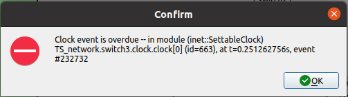

# Issues and Known Limitations
TAS-Forge is designed to provide a robust and flexible framework for generating TAS schedules. However, the tool is evolving and like any evolving tool, it has a number of known limitations with areas for improvement. These are outlined below to provide transparency and guide future development.

## 📏 Linear Topology
TAS-Forge currently supports only linear topologies for simulation. While this structure simplifies analysis and serves as a useful baseline, real-world TSN deployments often involve more complex topologies such as ring, tree, or mesh, particularly to support redundancy and fault tolerance etc. Extending TAS-Forge to support these topologies is left as future work to enable more comprehensive and application-relevant studies.

## ✋Limitations on Certain Values
While TAS-Forge offers users flexibility to configure various parameters, such as the number of devices, certain other value selections may lead to functional or performance limitations. The specific constraints and their potential impact are detailed below.

### ⏲️Synchronization Periodicity:
By default, TAS-Forge uses a synchronization periodicity of 125 ms, as recommended by IEEE 802.1AS. This value can be modified to other log2-based intervals, such as:
- 2⁻⁴ = 62.5 ms
- 2⁻¹ = 0.5 s

To adjust this, modify the following line in `generate_network_system.m`:
<pre>
T_sync = 0.125; % Synchronization periodicity in seconds  
</pre>

Note: Reducing the synchronization periodicity (e.g., below 125 ms) may cause synchronization messages to interfere with time-sensitive traffic, potentially leading to frame collisions or scheduling violations. Therefore, care should be taken when modifying this parameter.

### 🐌 Link Speed:
In TAS-Forge, all network links are configured by default to operate at 1 Gigabit Ethernet (1 GE). This is defined in the generate_network_system.m file using the parameter:

<pre>
data_rate = 1e9; % Bitrate in bits per second  
</pre>

While this value can technically be modified, it is not recommended, as multiple references to the link speed are hardcoded within the generated OMNeT++ configuration files. Changing the link speed would require updating all corresponding references across the simulation setup, which is error-prone and labor-intensive. As such, link speed customization is left as a future enhancement for improved flexibility.

### 🔬 Macrotick Granularity:
The default macrotick granularity in TAS-Forge is 0.1 µs with other recomended values of 0.01 µs or 1 µs, representing the time resolution used for Gate Control Lists (GCLs). While this value can be adjusted to increase or decrease resolution, setting it to a finer granularity (i.e., below 0.1 µs) may lead to alignment issues, as the GCL entries may no longer match correctly with computed scheduling offsets. This can result in timing mismatches and unintended behavior during simulation.

## 👹 List of Errors (MATLAB)
During the TAS-Forge workflow, certain errors may arise that prevent successful execution. Below is a list of common errors and their causes, along with suggestions for troubleshotting. There error messages generated by MATLAB are enclosed by `!!!` markers and are displayed in the MATLAB command window.

### 💢 Switch and Sink Connections:
This error occurs when a single source is connected to multiple switches, violating the assumption of a linear topology when the script `generate_network_system` is generated. It indicates that the current configuration does not allow for a valid linear path based on the number of switches and the arrangement of sources and sinks. 

<pre>
!!! Not enough switches to make unique connections to each sink !!!  
</pre>

**Troubleshooting:**
- To resolve this, adjust the topology parameters (number of sources, switches, and sinks) to ensure that each source and sink pair can be uniquely connected in a linear fashion.

### 💢 Scheduler Selection:
TAS-Forge supports only four schedulers: **WCA**, **WCD**, **NCA**, and **NCD**. If any other scheduler is selected, or if there is a typo in the scheduler name during the GCL generation via the `generate_GCL_output` script, the following error will be triggered:

<pre>
!!! Wrong scheduler selected !!!  
</pre>

**Troubleshooting:**
- For rectification, re-run the script and select an appropriate scheduler. 

### 💢 Decision Variable Not Loaded:
If the decision variable output from CPLEX is not correctly loaded during the workflow, the script `generate_GCL_output` will throw an error. An example of this error is:

<pre>
!!! The decision variable OFF_1_switch2 has not been loaded !!!  
</pre>

This indicates that the decision variable for Stream 1 in Switch 2 (denoted by `OFF_1_switch2`) has not been loaded correctly. 

**Troubleshooting:**
- Ensure that the CPLEX optimization has completed successfully and the decision variable output file has been loaded in MATLAB.
- Verify that the CPLEX output text file contains the expected decision variables.
- Confirm that the file path and format are consistent with TAS-Forge’s expected input.

### 💢 Overlapping Condition:
Even if the decision variables are correctly generated by CPLEX and successfully loaded into MATLAB, inconsistencies can still arise. These can lead to overlapping scheduling durations of frames from different streams at a shared egress port, violating the non-overlapping constraint required for valid TAS schedules. TAS-Forge detects such conflicts based on the input GCLs fed to the `generate_GCL_output` script and will halt the workflow until the issue is resolved to ensure the validity of the schedule and its determinism.

<pre>
!!! There is an overlapping condition in forming GCLs !!!  
</pre>

**Troubleshooting:**
- Consider switching to an alternate scheduling framework (e.g., NCA or WCD).
- Reconfigure key network parameters, such as the number of switches, sinks, and sources.
- Adjust stream-specific parameters like stream transmission periods, frame sizes, etc. to reduce contention and enable scheduling.  

### 💢 NED File Generation Errors:
When generating the `.ned` file, if the execution of `generate_omnetpp_files` gives the following error, then this indicates that graph details generated from 'generate_network_system' has either not been loaded or the script itself has not been executed.

<pre>
!!! Graph has not been generated yet !!!  
</pre>

**Troubleshooting:**
- If the graph has not been generated, restart the TAS-Forge workflow from the beginning.
- If the graph was previously generated and saved, ensure that the corresponding workspace is loaded before executing `generate_omnetpp_files`.

Users can manually adjust the x-y display area for the generated `.ned` file. If the specified display dimensions are too small to accommodate the full network topology, the following error will be triggered:

<pre>
!!! Display area values must be greater than scalar values !!!
</pre>

**Troubleshooting:**
- Ensure that the specified x and y display values are larger than the maximum x-y coordinates used in the network topology layout. This ensures all devices fit within the visible simulation area.

### 💢 INI File Generation Errors:
Generating the `.ini` files requires properly computed and loaded GCL outputs. If the GCLs are incomplete or not correctly loaded, the following errors may occur:

- This error indicates that source offset values have not been generated:
<pre>
!!! Source offset values not available !!!  
</pre>

- The gate states indicate that the initial gate states of each GCL have not been correctly loaded.
<pre>
!!! Gate states not loaded !!!  
</pre>

**Troubleshooting:**
- Ensure that the GCLs have been successfully generated using the appropriate scheduling method.
- Re-run the GCL generation step (`generate_GCL_output`) before executing the INI file generation.
- Load any saved workspaces if the respective values are not available. 

### 💢 Analyzing OMNeT++ Results:
Analyzing OMNeT++ simulation results is the final step in the TAS-Forge workflow. The `analyze_omnet_results` script assumes that all prior steps have been successfully completed. If any of the required steps have not been completed, the script will produce an error message and halt execution.

- This message indicates that the OMNeT++ simulations have not been executed and/or the `results.csv` file has not been loaded into the MATLAB workspace.
<pre>
!!! The OMNeT++ files have not been executed. !!!  
</pre>
- The following error is generated if any of the scheduler is not selected before script execution.
<pre>
!!! Scheduler type not selected, regenerate GCLs. !!!  
</pre>
- A mismatch between the stream data generated by `generate_network_system` and the output from OMNeT++ suggests an error or misalignment in the workflow configuration.
<pre>
!!! Number of streams does not match expected values. Please re-check results. !!!  
</pre>

**Troubleshooting:**
- Ensure that all required workspaces and files are correctly loaded into MATLAB.
- Re-run the OMNeT++ simulation and confirm that all output files (e.g., `.sca`, `.vec`, `results.csv`) are generated as expected. 
- Verify that a valid scheduler type has been selected before proceeding with analysis.

##  👺 Errors in Simulation (OMNeT++)
During OMNeT++ simulation, users may encounter the following INET error. This indicates that synchronization clock forwarding events were not executed as expected:

To rectify this issue, the clock settings in the INET framework needs to be modified. 

Navigate to the `SettableClock.ned` file located in the following directory 📁:

<pre>
inet/clock/model  
</pre>
