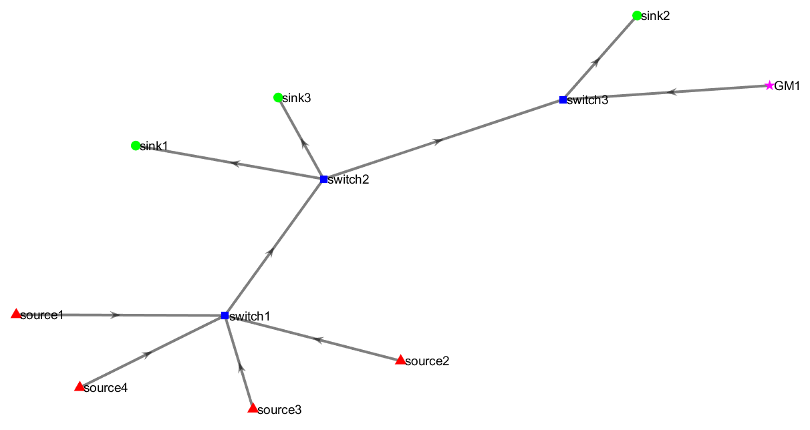

# Technical Overview
TAS-Forge is a simulation and scheduling automation tool designed for Time-Sensitive Networking (TSN). It focuses on IEEE 802.1Qbv, the Time-Aware Shaper (TAS), while also incorporating IEEE 802.1AS time synchronization into the scheduling process. The tool automatically generates linear network topologies in MATLAB, formulates Gate Control Lists (GCLs) using Integer Linear Programming (ILP) via IBM CPLEX, and evaluates scheduling performance through simulations in OMNeT++.

🌟 **Important:** For an understanding of nomenclature used in this documentation (such as `frames`,`streams`, etc.) and an understanding of the different TAS scheduling frameworks refer to [1]. 

## 🧩 System Architecture
TAS-Forge operates across five sequential phases:

1. Toplogy & Stream Generation (MATLAB)
    - Users define the number of sources, sinks, and switches.
    - A linear topology is generated automatically.
    - Routes are created between source and sink pairs with corresponding time-sensitive traffic streams.
    - Each stream are dynamically assigned key attributes including periodicity, deadline, and frame payload size.
2. TAS Scheduling considering Time Synchronization (CPLEX)
    - The TAS scheduling frameworks are fomulated as ILP methods that account for time synchronization effects.
    - CPLEX-compatible `.mod` files are automatically generated.
    - These models can be executed using IBM CPLEX optmization studio.
    - Upon sucessful execution, TAS schedule offsets are computed as decision variable outputs. 
3. GCL Formation (MATLAB)
    - The extracted CPLEX outputs are parsed to generate GCLs for each switch egress port.
    - Additional metrics related to the schedule quality known as schedulability cost are compluted.
4. Network Simulation (OMNeT++)
    - OMNeT++ compatible simulation `.ned` and `.ini` files are generated to evaluate the TAS schedules.
    - Simulations evaluate the TAS schedule performance, including the impact of synchronization behavior across devices.
5. Performance Metrics (MATLAB)
    - Simulation results are parsed and analyzed to evaluate end-to-end (e2e) latency, jitter, and overall scheduling efficiency.
    - Results are summarized in easy-to-read tables and can be exported to .csv for further post-processing.   

📌 *For a detailed list and description of the files, generated files (e.g. `.csv`,`.mod`,`.ini`,`.ned`) and folder structure refer to the [User Guide](User_Guide.md).*

## ⛏️ Topology Generation
TAS-Forge automatically generates a **linear network topology** based on user-defined input parameters, such as the number of **sources**, **sinks**, and **switches**. This topology forms the backbone of the simulation environment and influences the structure of routing paths and traffic streams.

Key Features of Topology Generation:
- **Linear Design:** The network topology is structured in a linear fashion, where traffic streams sequentially from source nodes to sink nodes through a chain of interconnected switches.
- **Route Construction:** Based on the generated topology, TAS-Forge automatically establishes communication routes between each source and sink pair. These routes specify the exact sequence of network devices (including switches) that each stream will traverse.
- **Flexible Source-Sink Mapping:** While each stream corresponds to a unique source-sink pair, the overall design allows for flexible mappings, i.e., a single source can transmit to multiple sinks, and a single sink can receive traffic from multiple sources.
- **Visual Figure:** A visual figure is generated represnting the network topology. 

The example below illustrates a simple topology consisting of 4 sources 🔺 and 3 sinks 🟢 interconnected through 3 switches 🟦.

The MATLAB command window displays the following source and sink pairs:

<pre>
Source to Sink Pairs:
source1 ---> sink1
source4 ---> sink2
source3 ---> sink3
source2 ---> sink1    
</pre>

Note that the routes are dynamically generated — not all routes traverse all three switches; each stream follows a path based on its source-sink pairing.

A ⏲️ Grand Master (GM) is automatically generated and positioned within the topology. It serves as the primary source of periodic time synchronization messages and is later modeled in the network simulation phase.

As part of the topology generation process, TAS-Forge creates a `.csv` file titled `port_connections.csv`.

This file records the connections between source and destination network devices, specifying:
- The egress port on the source device.
- The ingress port on the destination device.
- The set of routes with route identifiers traversing through that connection (listed in the Routes Included column).

An example based on the generated topology is shown below:

<pre>
Source    Source Port    Destination    Destination Port    Routes Included
switch1   0              switch2        0                   [1, 2, 3, 4]
switch2   1              switch3        0                   [4]
switch2   2              switch3        0                   [1, 3]
switch2   3              sink1          0                   [2]
switch3   1              sink2          0                   [4]
source1   0              switch1        1                   [1]
source2   0              switch1        2                   [3]
source3   0              switch1        3                   [2]
source4   0              switch1        4                   [4]
GM1       0              switch3        2                   [0]    
</pre>

## 🏘️ List of Parameters
To enable precise and realistic TAS scheduling, TAS-Forge requires a models of a set of timing, network-wide, and stream-level parameters. These parameters define the impact of time synchronization in the network, how traffic flow through the network, and how the devices are configured. Together, these form the foundation for generating valid schedules and assessing the performance of TSN deployments.

### ⏰ Time Synchronization Parameters
Time synchronization is a cornerstone of TSN, enabling coordinated communication across devices by aligning them to a common time reference. In TAS-Forge, synchronization-related parameters are explicitly modeled to reflect the impact of clock drift and periodic sync updates on schedule accuracy. Accurate TAS schedule generation requires careful consideration of these synchronization dynamics, making these parameters essential for realistic simulation.
- **Clock Drift:** Each network device is attached with a random constant clock drift value within a configurable *parts per million (ppm)* range. The default range is set between `-10 ppm` to `+10 ppm`. To update this change the `p_range` parameter in `generate_network_system.m`. 
- **Synchronization Periodicity:** This defines how frequently the GM sends synchronization messages across the network. By default, it is set to `125 ms`, aligning with the recommended value in the IEEE 802.1AS standard [3].
  It is **strongly recommended** not to modify this setting. For more details, refer to the [Known Issues and Limitations](Issues_and_Limitations.md) page.
- **Delta value:** Represents the maximum possible timing difference between any two devices in the network.

All generated clock drift values for the devices in the network are stored in the `node_data.csv` file, which is automatically generated after executing the `generate_network_system.m` script. 

💡**Note:** If you wish to modify the clock drift values manually and directly to the `.csv` (clock drift values are converted from ppm to seconds in the `.csv` file), these changes will need to made **before** proceeding the GCL schedule generation step. 

### 📡 Network Parameters
Network parameters define the operational context of the Time-Sensitive Network (TSN). These values influence how streams are scheduled and how delays propagate through the network.
- **Link Speed:** All network links are configured with a bitrate of `1 Gigabit per second (Gbps)`. 
- **Propagation Delay:** Represents the time taken by frames to travel between two network devices. Set to a default value of `50 nanoseconds (ns)` considering a linkspeed of 1 Gbps.
- **Processing Delay:** A constant internal delay incurred within switches to process frames, set by default to `1550 ns`.
- **Guard Band:** A reserved time interval to prevent non-time-sensitive frames from interfering with scheduled transmissions, currently set to `0 seconds` by default.. 
- **Macrotick:** A base time unit to set all devices to a common time-unit. Default value of `0.01 microseconds (µs)` parameter is used. However, other **recommended** values are `0.1 µs` or `1 µs`.  
- **Hyperperiod:** Hyperperiod is defined as the least common multiple of time-sensitive stream periodicities in the network *(see below)*.

The relevant network parameters are stored in the `network_data.csv` file, which is automatically generated after executing the `generate_network_system.m` script.

💡**Note:** Relevant changes to the network parameters can be changed from the `generate_network_system.m` script. 

### 📦 Stream Parameters
Each route in the network is associated with a **stream**, which represents a unidirectional flow of time-sensitive data frames from a source to a sink. Each stream is characterized by specific parameters essential for TAS scheduling. These include:
- **Stream ID**: A unique identifier assigned to each stream.
- **Route**: The complete path traversed by the stream, including the source, sink, and all intermediary switches.
- **Periodicity**: The frequency at which frames are generated. Periodicities are randomly assigned from a predefined set in the `T_period` array within the `generate_network_system.m` script. You can customize the stream periodicities by modifying this array.
- **Payload Size**: The size of each data frame (default: `100 Bytes`). This can be changed by editing the `payload` variable in `generate_network_system.m`. Note that the total frame size includes additional header overhead from the UDP and Ethernet layers.
- **Minimum Possible e2e latency:** The E2E latency for each stream over the route caclulcated considering only propagation, processing and transmission delays but no queuing delays. 
- **Deadline:** Each stream has a deadline constraint, set equal to the stream periodicity for simplicity. However, given the TAS simulated frameworks, the e2e latency is always equal to the minimum E2E latency or bounded based on analytical models. For further insights into the scheduling framework and analytical latency boundaries, refer to [1] and [2] respectively. 
- **Number of Hops:** The total number of links between the source and the sink.
- **Transmission Delay:** The time required for a frame to be transmitted from the egress port of a network device. Since all network links are assumed to operate at the same speed, the transmission delay remains constant for a given stream across all links in the topology.
- **L-Parameter:** The summation of propagation, processing and transmission delays between any two devices, also a constant parameter. 

All stream-related parameters are stored in the `stream_data.csv` file, which is automatically generated after executing the `generate_network_system.m` script.

💡 **Note:** Each stream operates independently, and all timing-related parameterd are defined relative to the macrotick unit used in the simulation.

## 🚦Gate Control List (GCL)

## References:
[1] Aviroop Ghosh, Saleh Yousefi, and Thomas Kunz. 2025. Multi-Stream TSN Gate Control Scheduling in the Presence of Clock Synchronization. In Proceedings of the 26th International Conference on Distributed Computing and Networking (ICDCN '25). Association for Computing Machinery, New York, NY, USA, 11–20. https://doi-org.proxy.library.carleton.ca/10.1145/3700838.3700847

[2] A. Ghosh, S. Yousefi, and T. Kunz, "Latency Bounds for TSN Scheduling in the Presence of Clock Synchronization," *IEEE Networking Letters*, vol. 7, no. 1, pp. 41–45, March 2025. [DOI: 10.1109/LNET.2024.3507792](https://doi.org/10.1109/LNET.2024.3507792)

[3] IEEE Std. 802.1AS-2020 (Revision of IEEE Std 802.1AS-2011), “IEEE Standard for Local and Metropolitan Area Networks–Timing and synchronization for time-sensitive applications,” 2020. ISBN: 9781504464307.
