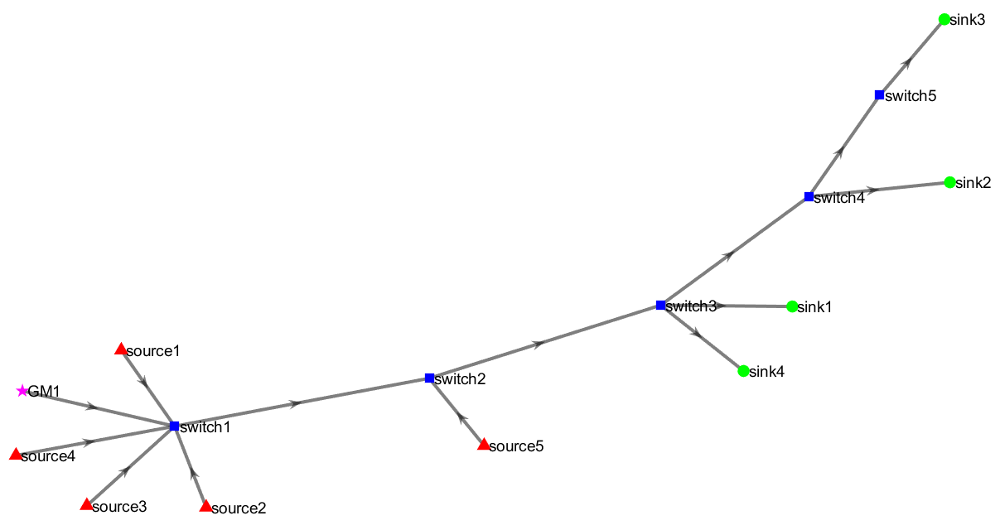

# ⚽ Goal
This showcase provides a complete walkthrough of TAS-Forge’s workflow through a hands-on example. It demonstrates the end-to-end process of generating Time-Aware Shaper (TAS) schedules using the Worst-Case Delay (WCD) scheduling framework.

It demonstrates the complete process of generating TAS schedules using the **Worst-Case Delay (WCD)** scheduling framework on a network topology consisting of **5 switches**, **5 sources**, and **4 sinks**.

The showcase highlights each major phase: 
- Automatic generation of the network topology and time-sensitive streams
- Formulation of TAS scheduling constraints considering time synchronization
- Solving the scheduling problem using CPLEX
- Generation of Gate Control Lists (GCLs)
- Preparation of simulation files for OMNeT++

This example highlights how TAS-Forge simplifies TAS schedule creation, allowing users to generate, validate, and analyze time-sensitive network schedules efficiently.

# 🏠 Step-by-Step Showcase: Creating TAS Schedules with TAS-Forge
This showcase follows the step-by-step walkthrough as detailed in the [User Guide](../../documentation/User_Guide.md). 

## 🏗️ Step 1: Configure the Network Topology
- Open MATLAB and navigate to the TAS-Forge project folder.
- Run the following script:
  <pre>
  generate_network_system  
  </pre>
- Enter the number of 🟥 **sources**, 🟢 **sinks** & 🟦 **switches** in the input text box as shown below:
  

- The network tolopogy is generated as an image shown below:

