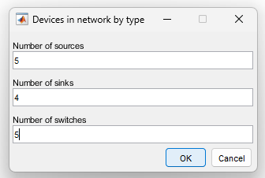
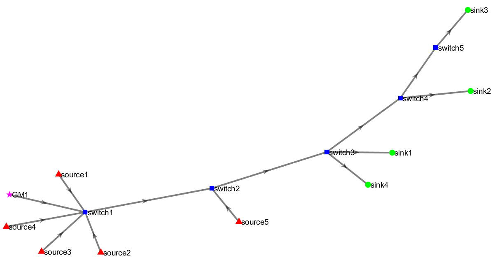
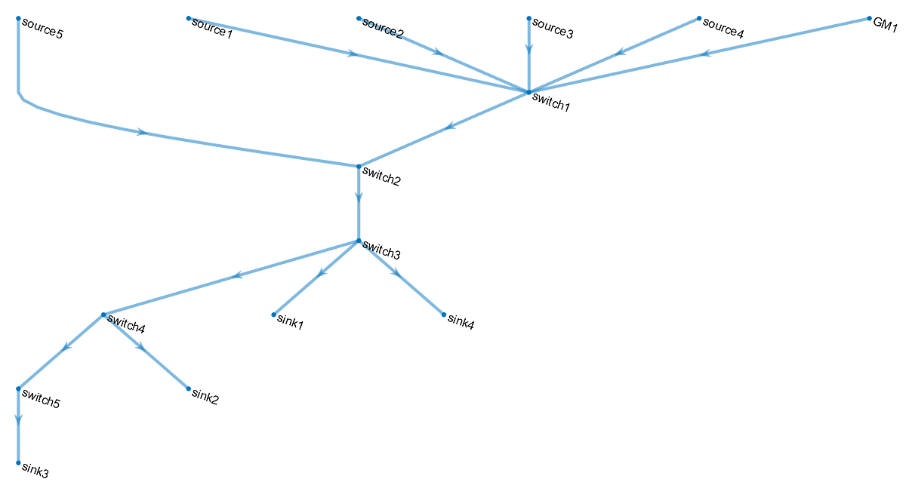
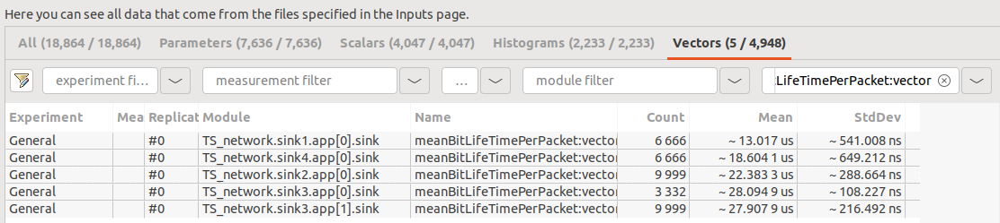

# ⚽ Goal
This showcase provides a complete walkthrough of TAS-Forge’s workflow through a hands-on example. It demonstrates the end-to-end process of generating Time-Aware Shaper (TAS) schedules using the Worst-Case Delay (WCD) scheduling framework.

It demonstrates the complete process of generating TAS schedules using the **Worst-Case Delay (WCD)** scheduling framework on a network topology consisting of **5 switches**, **5 sources**, and **4 sinks**.

The showcase highlights each major phase: 
- Automatic generation of the network topology and time-sensitive streams
- Formulation of TAS scheduling constraints considering time synchronization
- Solving the scheduling problem using CPLEX
- Generation of Gate Control Lists (GCLs)
- Preparation of simulation files for OMNeT++

This example highlights how TAS-Forge simplifies TAS schedule creation, allowing users to generate, validate, and analyze time-sensitive network schedules efficiently.

This guide demonstrates how to replicate the showcased example using TAS-Forge.

🚨 **Do not** close MATLAB until all steps are completed. If you need to pause midway, use the save workspace command to preserve your progress, and resume later.

# 🪜 Step-by-Step Showcase: Creating TAS Schedules with TAS-Forge
This showcase follows the step-by-step walkthrough as detailed in the [User Guide](../../documentation/User_Guide.md). 

## 💻 Step 1: Configure the Network Topology
- Open MATLAB and navigate to the TAS-Forge project folder.
- Run the following script:
  <pre>
  generate_network_system  
  </pre>
- Enter the number of 🔺**sources**, 🟢 **sinks** & 🟦 **switches** in the input text box as shown below:
  

- A network topology will be automatically generated, similar to the one displayed as shown below:

- The script also generates a set of **source-to-sink** routes:
<pre>
Source to Sink Pairs:
source5 ---> sink1
source4 ---> sink2
source1 ---> sink3
source2 ---> sink4
source3 ---> sink3
</pre>

- The `generate_network_system.m` script also generates `.csv` files containing information relevant to:
    - **Node clock drift information** (`node_data.csv`) for time synchronization modeling
    - **Network parameters** (`network_data.csv`) such as, link speeds, propagation delays, hyperperiod, etc.
    - **Stream definitions and properties** (`stream_data.csv`) such as, stream ids, routes, periodicity, payload size, deadlines
- Upon sucessful creation, the following messages will appear in the MATLAB command window.
<pre>
Node output file "node_data.csv" has been created.
Network output file "network_data.csv" has been created.
Stream output file "stream_data.csv" has been created.
Port connections output file "port_connections.csv" has been created.  
</pre> 
- The script also creates the `CPLEX_Code_Output` folder containing the `.mod` files for all supported scheduling frameworks. The MATLAB command window will display: 
<pre>
Directory created for storing CPLEX codes.
Output file "output_CPLEX_code_generator_WCD.mod" has been generated in the CPLEX_Code_Output folder.
Output file "output_CPLEX_code_generator_NCD.mod" has been generated in the CPLEX_Code_Output folder.
Output file "output_CPLEX_code_generator_WCA.mod" has been generated in the CPLEX_Code_Output folder.
Output file "output_CPLEX_code_generator_NCA.mod" has been generated in the CPLEX_Code_Output folder.  
</pre>

## 🏗️ Step 2: Solve TAS Schedule using IBM CPLEX
- From the `CPLEX_Code_Output` folder select the `output_CPLEX_code_generator_WCD.mod` file. 
- Launch CPLEX Optimization Study, and after creating an OLP project, run the `.mod` file.
- Once executed, the **decison variables** (similar as shown) outputs are generated in the **Solutions** tab in CPLEX studio.
<pre>
lambda_1 = 122.82;
lambda_2 = 177.82;
lambda_3 = 232.82;
lambda_4 = 287.82;
lambda_5 = 287.82;
OFF_1_source5 = 0;
OFF_1_switch2 = 55;
OFF_1_switch3 = 110;
OFF_2_source2 = 52;
OFF_2_switch1 = 107;
OFF_2_switch2 = 162;
OFF_2_switch3 = 217;
OFF_3_source4 = 104;
OFF_3_switch1 = 159;
OFF_3_switch2 = 214;
OFF_3_switch3 = 269;
OFF_3_switch4 = 324;
OFF_4_source1 = 1156;
OFF_4_switch1 = 1211;
OFF_4_switch2 = 1266;
OFF_4_switch3 = 1321;
OFF_4_switch4 = 1376;
OFF_4_switch5 = 1431;
OFF_5_source3 = 0;
OFF_5_switch1 = 55;
OFF_5_switch2 = 110;
OFF_5_switch3 = 165;
OFF_5_switch4 = 220;
OFF_5_switch5 = 275;
</pre>

- CPLEX will output a text file `output_CPLEX_solution_WCD.txt`.
- This file will carry all the relevant decision variables, specifically the **offset** variables in the format `OFF_<streamID>_<deviceName>`.
- ⚠️ **Note:** CPLEX may issue a warning indicating that the variable `trans_delay_var` is unused. This warning can be safely ignored as it does not affect the execution or correctness of the model.
- 🔥 **Important:** The `lambda` decision variables (e.g., `lambda_1`, `lambda_2`, etc.) will not appear in the text output file as it is not required by TAS-Forge.
- Move the `output_CPLEX_solution_WCD.txt`file to the MATLAB directory where TAS-Forge is being executed.
  
## 🗒️ Step 3: Create Gate Control Lists (GCLs)
- To generate GCLs, run the following script to generate GCLs:
<pre>
generate_GCL_output  
</pre>

- Select the scheduler type when prompted. For this example, *WCD* need to be entered.
- Note: If you entered another scheduler type by mistake, it is ok, simply re-run the script.
- The script will read the offsets from `output_CPLEX_solution_WCD.txt`.
- It will then:
    - Create corresponding GCLs in the `output_GCL_matrix.txt`.
    - The **schedulability cost** metric is also displayed in the MATLAB command window.
<pre>
generate_GCL_output
What scheduler did you select (WCA/WCD/NCA/NCD)?:  WCD
File "output_GCL_matrix.txt" has been created.

The schedulability cost is 0.0245
</pre>

## 🏭 Step 4: Generate Simulation Configuration
- To generate the `.ned` and `.ini` files, run the following script:
<pre>
generate_omnetpp_files  
</pre>
- The script will create `OMNETpp_Code_Output` directory for storing the generated files.
- The `.ned` will be generated, along with a figure denoting all network devices and the traffic flow directions based on the topology (similar to the one shown below).
- If the `output_GCL_matrix.txt` file is read sucessfully, the script will also generate the corresponding `.ini` file containing the simulation configuration.
- Both files are necessary to run the TAS-Forge simulation inside OMNeT++.

MATLAB command window output is shown below, displaying successful `.ned` and `.ini` file generation:
<pre>
generate_omnetpp_files
OMNETpp_Code_Output directory has been created.
NED file generated_topology.ned generated successfully in directory OMNETpp_Code_Output.
File "output_GCL_matrix.txt" read successfully
INI file simulation_config_WCD.ini generated successfully in directory OMNETpp_Code_Output.
</pre>

## 🔬 Step 5: Analyzing Simulation Results
- Import the `.ned` and `.ini` generated from Step 4 for loading in OMNeT++.
- Run the simulation for a default period of 1 second. 
- After the simulation completes, navigate to generated `.vec` result file.
- Filter the results based on selecting entries labeled `meanBitLifeTimePerPacket:vector`, which represents the end-to-end latency for each frame (as shown below).

- Export the results as a `.csv` file and name it `results.csv`.
- Transfer the `.csv` file to your MATLAB workspace with TAS-Forge.
- Run the following command in your MATLAB command window:
<pre>
 analyze_omnet_results 
</pre> 
- This should create a `stream_data_output_WCD.csv` file and the following prompt will be displayed:
<pre>
Warning: Table variable names were truncated to the length namelengthmax. The original names are saved in the
VariableDescriptions property. 
Results saved to stream_data_output_WCD.csv
Warning: Column headers from the file were modified to make them valid MATLAB identifiers before creating variable names
for the table. The original column headers are saved in the VariableDescriptions property.
Set 'VariableNamingRule' to 'preserve' to use the original column headers as table variable names. 
Results updated to stream_data_output_WCD.csv
</pre>
- The warnings from MATLAB can be ignored. 
- The output `.csv` file should provide a summary of the streams including the analytical and meaured end-to-end latencies, jitter, routes, etc.
- The measured end-to-end latencies fall within the boundaries of the analytical end-to-end latencies.
- For further details on interpreting the results refer to the [Technical Overview](../../documentation/Technical_Overview.md) page. 

# ✅ Summary
This showcase demonstrated the use of TAS-Forge workflow using the WCD method:
- Topology and stream generation.
- Scheduling using CPLEX.
- GCL creation.
- OMNeT++ simulation.
- Result analysis for the WCD method.
