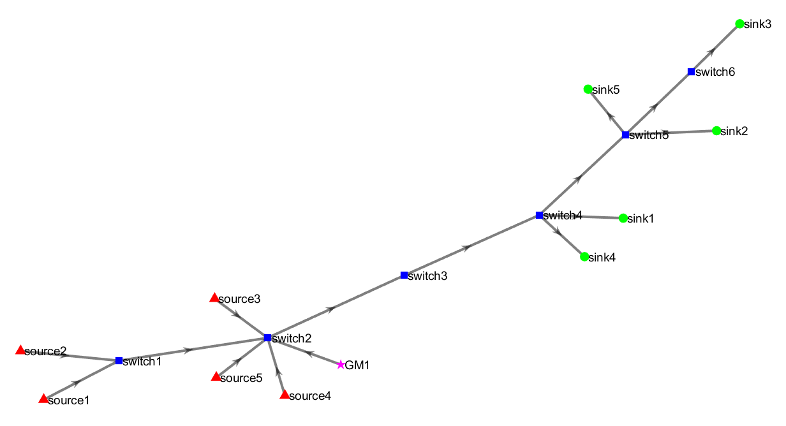

# 🥅 Goal
This showcase provides a step-by-step walkthrough of TAS-Forge’s workflow for comparing two scheduling frameworks applied to the same network topology. It demonstrates the full TAS-Forge generation process using both the **Network-Derived Clock Drift Adjustment (NCA)** and **Worst-Case Adjustment (WCA)** scheduling methods.

The network topology considered consists of 🟦 **6 switches**, 🔺 **5 sources** and 🟢 **5 sinks**.  

The showcase highlights each major phase including:
- Generation of the network topology and time-sensitive streams.
- Formulation of TAS scheduling constraints using CPLEX for both the NCA and WCA scheduling methods.
- Generation of Gate Control Lists (GCLs) for the NCA method.
- Preparation and execution of simulation files for OMNeT++ for the NCA scheduling method.
- Generation of GCLs for the WCA method.
- Preparation and execution of simulation files for OMNeT++ for the WCA scheduling method.
- Analysis of the results from both scheduling frameworks.  

This guide demonstrates how to replicate the showcased example using TAS-Forge. 

🚨 **Do not** close MATLAB until all steps are completed. If you need to pause midway, use the save workspace command to preserve your progress, and resume later.

# 🪜Step-by-Step Guide: Generating Schedules with NCA and WCA Methods Using TAS-Forge
This showcase follows the step-by-step walkthrough as detailed in the [User Guide](../../documentation/User_Guide.md).

For an understanding of the different scheduling frameworks, read the [Technical Overview](../../documentation/Technical_Overview.md). 

## 🚧 Step 1: Configure the Network Topology 
- Open MATLAB and navigate to the TAS-Forge project folder.
- Run the following script:
  <pre>
  generate_network_system  
  </pre>
- Enter the number of 🔺 **5 sources**, 🟢 **5 sinks** & 🟦 **6 switches** in the input text box.
- A network topology will be automatically generated, similar to the one displayed as shown below:

- The script also generates a set of **source-to-sink** for 6 routes:
<pre>
Source to Sink Pairs:
source2 ---> sink1
source1 ---> sink2
source1 ---> sink3
source5 ---> sink4
source3 ---> sink5
source4 ---> sink3
</pre>

- The `generate_network_system.m` script also generates `.csv` files containing information relevant to:
    - **Node clock drift information** (`node_data.csv`) for time synchronization modeling
    - **Network parameters** (`network_data.csv`) such as, link speeds, propagation delays, hyperperiod, etc.
    - **Stream definitions and properties** (`stream_data.csv`) such as, stream ids, routes, periodicity, payload size, deadlines
- Upon sucessful creation, the following messages will appear in the MATLAB command window.
<pre>
Node output file "node_data.csv" has been created.
Network output file "network_data.csv" has been created.
Stream output file "stream_data.csv" has been created.
Port connections output file "port_connections.csv" has been created.  
</pre> 
- The script also creates the `CPLEX_Code_Output` folder containing the `.mod` files for all supported scheduling frameworks. The MATLAB command window will display: 
<pre>
Directory created for storing CPLEX codes.
Output file "output_CPLEX_code_generator_WCD.mod" has been generated in the CPLEX_Code_Output folder.
Output file "output_CPLEX_code_generator_NCD.mod" has been generated in the CPLEX_Code_Output folder.
Output file "output_CPLEX_code_generator_WCA.mod" has been generated in the CPLEX_Code_Output folder.
Output file "output_CPLEX_code_generator_NCA.mod" has been generated in the CPLEX_Code_Output folder.  
</pre>

## 🙇 Step 2: Workflow for NCA Scheduling Framework 
After generating the network topology, the workflows for each scheduling framework should be separated. This step outlines the complete process for the NCA scheduling framework—from schedule generation and GCL creation to OMNeT++ simulation and result analysis.

### 🧍‍♂Step 2A: Solve NCA TAS Schedules using IBM CPLEX
- From the `CPLEX_Code_Output` folder select the `output_CPLEX_code_generator_NCA.mod` file. 
- Launch CPLEX Optimization Study, and after creating an OLP project, run the `.mod` file.
- Once executed, the **decison variables** (as shown) outputs are generated in the **Solutions** tab in CPLEX studio.
<pre>
lambda_1 = 96.57;
lambda_2 = 124.57;
lambda_3 = 152.07;
lambda_4 = 151.32;
lambda_5 = 152.32;
lambda_6 = 180.32;
OFF_1_source5 = 66;
OFF_1_switch2 = 88;
OFF_1_switch3 = 112;
OFF_1_switch4 = 141;
OFF_2_source2 = 74;
OFF_2_switch1 = 81;
OFF_2_switch2 = 114;
OFF_2_switch3 = 138;
OFF_2_switch4 = 167;
OFF_3_source1 = 0;
OFF_3_switch1 = 17;
OFF_3_switch2 = 50;
OFF_3_switch3 = 74;
OFF_3_switch4 = 103;
OFF_3_switch5 = 133;
OFF_4_source3 = 114;
OFF_4_switch1 = 119;
OFF_4_switch2 = 152;
OFF_4_switch3 = 176;
OFF_4_switch4 = 205;
OFF_4_switch5 = 235;
OFF_5_source4 = 0;
OFF_5_switch2 = 22;
OFF_5_switch3 = 46;
OFF_5_switch4 = 75;
OFF_5_switch5 = 105;
OFF_5_switch6 = 137;
OFF_6_source1 = 1141;
OFF_6_switch1 = 1158;
OFF_6_switch2 = 1191;
OFF_6_switch3 = 1215;
OFF_6_switch4 = 1244;
OFF_6_switch5 = 1274;
OFF_6_switch6 = 1306;
</pre>
- The CPLEX directory should generate the `output_CPLEX_solution_NCA.txt` file containing all the relevant decision variables required to be created for GCL generation. 
- Move the `output_CPLEX_solution_NCA.txt` file to the MATLAB directory where TAS-Forge is being executed.

### 🚶Step 2B: Create the GCLs
- To generate GCLs, run the following script to generate GCLs:
<pre>
generate_GCL_output  
</pre>

- Select the scheduler type when prompted. In this case, *NCA* needs to be entered.
- Note: If you entered another scheduler type, re-run the script. 
- The script will:
    - Create corresponding GCLs in the `output_GCL_matrix.txt`.
    - The **schedulability cost** metric is also displayed in the MATLAB command window.
<pre>
generate_GCL_output
What scheduler did you select (WCA/WCD/NCA/NCD)?:  NCA
File "output_GCL_matrix.txt" has been created.

The schedulability cost is 0.0679333
</pre>

### 🏃 Step 2C: Generate Simulation Configuration
- To generate the `.ned` and `.ini` files, run the following script:
<pre>
generate_omnetpp_files  
</pre>
- The script will create `OMNETpp_Code_Output` directory for storing the generated files.
- The `.ned` will be generated, along with a figure denoting all network devices and the traffic flow directions based on the topology (similar to the one shown below).
- If the `output_GCL_matrix.txt` file is read sucessfully, the script will also generate the corresponding `.ini` file containing the simulation configuration.
- Both files are necessary to run the TAS-Forge simulation inside OMNeT++.

MATLAB command window output is shown below, displaying successful `.ned` and `.ini` file generation:
<pre>
generate_omnetpp_files
OMNETpp_Code_Output directory has been created.
NED file generated_topology.ned generated successfully in directory OMNETpp_Code_Output.
File "output_GCL_matrix.txt" read successfully
INI file simulation_config_NCA.ini generated successfully in directory OMNETpp_Code_Output.
</pre>

### 🤸 Step 2D: Analyzing Simulation Results
- Import the `.ned` and `.ini` generated from Step 2C and load into OMNeT++.
- Run the simulation for a default period of 1 second. 
- After the simulation completes, navigate to generated `.vec` result file.
- Filter the results based on selecting entries labeled `meanBitLifeTimePerPacket:vector`, representing the end-to-end latency.
- Export the results as a `.csv` file and name it `results.csv`.
- Transfer the `.csv` file to your MATLAB workspace with TAS-Forge.
- Run the following command in your MATLAB command window:
<pre>
 analyze_omnet_results 
</pre> 
- This should create a `stream_data_output.csv` file and the following prompt will be displayed:
<pre>
Results saved to stream_data_output.csv
Results updated to stream_data_output.csv  
</pre>
- The output `.csv` file summaries the stream metrics including the analytical and meaured end-to-end latencies, jitter, routes, etc.
- The measured end-to-end latencies fall within the boundaries of the analytical end-to-end latencies.
- Since the schedule gurantees no queuing delays along the route, the minimum and maximum end-to-end latencies will be equal, resulting in zero jitter.
- Rename the `stream_data_output.csv` to `stream_data_output_NCA.csv` for clarity. 

## 🙇‍♀️Step 3: Workflow for WCA Scheduling Framework
This step outlines the complete workflow for the WCA scheduling framework—from schedule generation and GCL creation to OMNeT++ simulation and result analysis.

### 🧍‍♀️Step 3A: Solve WCA TAS Schedules using IBM CPLEX
- From the `CPLEX_Code_Output` folder select the `output_CPLEX_code_generator_WCA.mod` file. 
- Launch CPLEX Optimization Study, and after creating an OLP project, run the `.mod` file.
- Once executed, the **decison variables** (as shown) outputs are generated in the **Solutions** tab in CPLEX studio.
<pre>
lambda_1 = 96.82;
lambda_2 = 124.82;
lambda_3 = 152.82;
lambda_4 = 152.82;
lambda_5 = 152.82;
lambda_6 = 180.82;
OFF_1_source5 = 0;
OFF_1_switch2 = 3;
OFF_1_switch3 = 31;
OFF_1_switch4 = 59;
OFF_2_source2 = 228;
OFF_2_switch1 = 231;
OFF_2_switch2 = 259;
OFF_2_switch3 = 287;
OFF_2_switch4 = 315;
OFF_3_source1 = 100;
OFF_3_switch1 = 103;
OFF_3_switch2 = 131;
OFF_3_switch3 = 159;
OFF_3_switch4 = 187;
OFF_3_switch5 = 215;
OFF_4_source3 = 164;
OFF_4_switch1 = 167;
OFF_4_switch2 = 195;
OFF_4_switch3 = 223;
OFF_4_switch4 = 251;
OFF_4_switch5 = 279;
OFF_5_source4 = 64;
OFF_5_switch2 = 67;
OFF_5_switch3 = 95;
OFF_5_switch4 = 123;
OFF_5_switch5 = 151;
OFF_5_switch6 = 179;
OFF_6_source1 = 1292;
OFF_6_switch1 = 1295;
OFF_6_switch2 = 1323;
OFF_6_switch3 = 1351;
OFF_6_switch4 = 1379;
OFF_6_switch5 = 1407;
OFF_6_switch6 = 1435;
</pre>
- The CPLEX directory should generate the `output_CPLEX_solution_WCA.txt` file containing all the relevant decision variables required to be created for GCL generation. 
- Move the `output_CPLEX_solution_WCA.txt` file to the MATLAB directory where TAS-Forge is being executed.

### 🚶‍♀️Step 3B: Create the GCLs
- To generate GCLs for the WCA scheduling method, run the following script to generate GCLs:
<pre>
generate_GCL_output  
</pre>

- **Note:** That will over-write the previously generated GCLs for the NCA scheduling method. 
- Select the scheduler type when prompted. In this case, *WCA* needs to be entered.
- The script will:
    - Create corresponding GCLs in the `output_GCL_matrix.txt`.
    - The **schedulability cost** metric is also displayed in the MATLAB command window.
<pre>
generate_GCL_output
What scheduler did you select (WCA/WCD/NCA/NCD)?:  WCA
File "output_GCL_matrix.txt" has been created.

The schedulability cost is 0.136533
</pre>

### 🏃‍♀️Step 3C: Generate Simulation Configuration
- To generate `.ini` file for the WCA scheduling method, run the following script:
<pre>
generate_omnetpp_files  
</pre>
- Since the `OMNETPP_Code_Output` directory was already created in Step 2C, it will not be recreated.
- The `.ned` will be re-generated, along with a topology diagram denoting all network devices and the traffic flow directions based on the topology.
- Given that this is the same `.ned` file generated from Step 2C, there is no need to copy it again into OMNeT++.
- The script will also generate the corresponding `.ini` file for the WCA scheduling method containing the simulation configuration.
- Load the `.ini` file in OMNeT++ to run the WCA configuration. 

MATLAB command window output is shown below, displaying successful `.ned` and `.ini` file generation:
<pre>
generate_omnetpp_files
NED file generated_topology.ned generated successfully in directory OMNETpp_Code_Output.
File "output_GCL_matrix.txt" read successfully
INI file simulation_config_WCA.ini generated successfully in directory OMNETpp_Code_Output.
</pre>

### 🤸‍♀️Step 3D: Analyzing Simulation Results
- Import the `.ini` generated from Step 3C and load into OMNeT++.
- Run the simulation for a default period of 1 second. 
- After the simulation completes, navigate to generated `.vec` result file.
- Filter the results based on selecting entries labeled `meanBitLifeTimePerPacket:vector`, representing the end-to-end latency.
- Export the results as a `.csv` file and name it `results.csv`.
- Transfer the `.csv` file to your MATLAB workspace with TAS-Forge.
- **Note:** This will overwrite any previous instances of `results.csv`. 
- Run the following command in your MATLAB command window:
<pre>
 analyze_omnet_results 
</pre> 
- This should create a `stream_data_output.csv` file (overwriting any existing one), and you will see following prompt will be displayed:
<pre>
Results saved to stream_data_output.csv
Results updated to stream_data_output.csv  
</pre>
- This will overwrite the `stream_data_output.csv` 
- The output `.csv` file summaries the stream metrics including the analytical and meaured end-to-end latencies, jitter, routes, etc.
- The measured end-to-end latencies fall within the boundaries of the analytical end-to-end latencies.
- Because the WCA schedule eliminates queuing delays, the minimum and maximum end-to-end latencies will be identical, resulting in zero jitter.
- Rename the `stream_data_output.csv` to `stream_data_output_WCA.csv` for clarity. 
